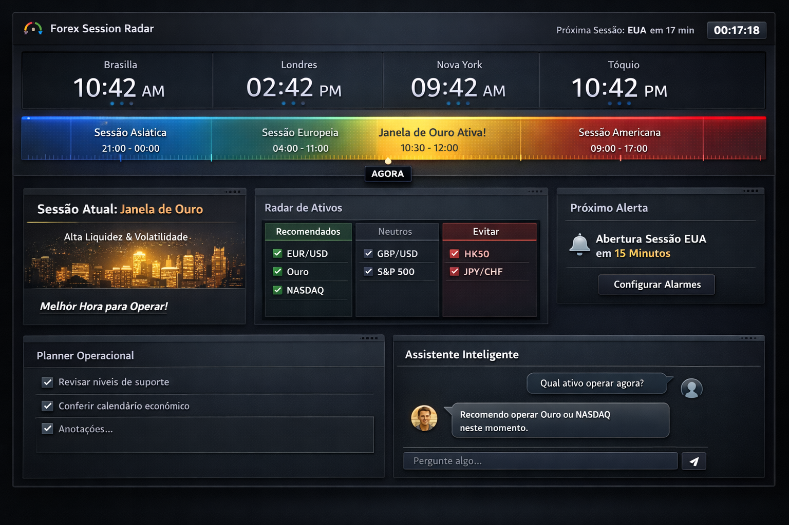

<a href="https://trendshift.io/repositories/19809" target="_blank"></a>
# Forex Session Radar

Aplicativo desktop para monitoramento operacional de sessoes Forex, overlap, alertas e assistente inteligente local/OpenAI.



## Visao Geral

O projeto roda em arquitetura local:

- Frontend: React + Vite + TypeScript + Tailwind
- Backend: Node.js + Express + Luxon
- Desktop: Tauri (macOS Silicon)
- Persistencia: JSON local

## Principais Funcionalidades

- Relogios globais em tempo real
- Timeline de sessoes com overlap e estado de mercado
- Ajuste de timezone com modo automatico e modo travado por cidade
- Logica de DST por timezone real
- Alertas com notificacoes locais
- Radar de ativos por contexto de sessao
- Planner operacional
- Assistente inteligente com fallback local e suporte OpenAI por API Key

## Estrutura do Projeto

```text
ForexRadar/
  frontend/        # React/Vite
  backend/         # API local (Express)
  src-tauri/       # Empacotamento desktop
  data/            # Dados locais
```

## Requisitos

- Node.js 20+
- npm 10+
- Rust toolchain (cargo/rustc)
- macOS (para build .app/.dmg)

## Como Rodar em Desenvolvimento

### 1) Instalar dependencias

```bash
npm install
```

### 2) Rodar stack web (frontend + backend)

```bash
npm run dev:web
```

- Frontend: `http://localhost:5173`
- Backend: `http://127.0.0.1:4783`

### 3) Rodar desktop com Tauri (dev)

```bash
npm run dev
```

## Build para Producao

```bash
npm run build
```

Saidas principais:

- `.app`: `src-tauri/target/release/bundle/macos/Forex Session Radar.app`
- `.dmg`: `src-tauri/target/release/bundle/dmg/Forex Session Radar_0.1.0_aarch64.dmg`

## Scripts

| Comando | Descricao |
|---|---|
| `npm run dev:web` | Sobe frontend + backend |
| `npm run dev` | Sobe app Tauri em modo dev |
| `npm run build` | Gera build desktop completo |
| `npm run build:frontend` | Build do frontend |
| `npm run build:backend` | Preparacao de build do backend |
| `npm run build:sidecar` | Build do sidecar backend |

## API Local

- `GET /api/health`
- `GET /api/dashboard`
- `PUT /api/preferences`
- `PUT /api/planner`
- `POST /api/assistant/query`

## Configuracao OpenAI (Opcional)

No chat, configure sua API key, ou envie no backend (`OPENAI_API_KEY`) para respostas via OpenAI.

## Troubleshooting

- Se aparecer erro de notificacao no navegador (message channel), teste sem extensoes.
- Se o app nao carregar em uma porta, confirme backend ativo em `127.0.0.1:4783`.
- Se faltar espaco em disco para build, limpe pastas geradas:

```bash
rm -rf src-tauri/target node_modules src-tauri/binaries frontend/dist backend/dist
```

Depois:

```bash
npm install
npm run build
```

## License

Defina a licenca do repositorio no GitHub (recomendado: MIT).
