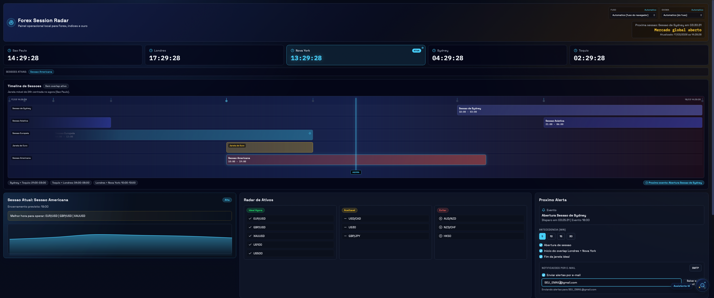

<a href="https://trendshift.io/repositories/19809" target="_blank"></a>
# Forex Session Radar

Aplicativo para monitoramento operacional de sessoes Forex, overlaps e radar de ativos (versao publica).

 

## Visao Geral

O projeto roda em arquitetura local:

- Frontend: React + Vite + TypeScript + Tailwind
- Backend: Node.js + Express + Luxon
- Desktop: Tauri (macOS Silicon)
- Persistencia: JSON local

## Principais Funcionalidades

- Relogios globais em tempo real
- Timeline de sessoes com overlap e estado de mercado
- Ajuste de timezone com modo automatico e modo travado por cidade
- Logica de DST por timezone real
- Radar de ativos por contexto de sessao
- Planner operacional (notas e checklist por navegador, em localStorage)
- Fuso horario e idioma configuraveis

## Estrutura do Projeto

```text
ForexRadar/
  frontend/        # React/Vite
  backend/         # API local (Express)
  src-tauri/       # Empacotamento desktop
  data/            # Dados locais
```

## Requisitos

- Node.js 20+
- npm 10+
- Rust toolchain (cargo/rustc)
- macOS (para build .app/.dmg)

## Como Rodar em Desenvolvimento

### 1) Instalar dependencias

```bash
npm install
```

### 2) Rodar stack web (frontend + backend)

```bash
npm run dev:web
```

- Frontend: `http://localhost:5173`
- Backend: `http://127.0.0.1:4783`

### 3) Rodar desktop com Tauri (dev)

```bash
npm run dev
```

## Build para Producao

```bash
npm run build
```

Saidas principais:

- `.app`: `src-tauri/target/release/bundle/macos/Forex Session Radar.app`
- `.dmg`: `src-tauri/target/release/bundle/dmg/Forex Session Radar_0.1.0_aarch64.dmg`

## Scripts

| Comando | Descricao |
|---|---|
| `npm run dev:web` | Sobe frontend + backend |
| `npm run dev` | Sobe app Tauri em modo dev |
| `npm run build` | Gera build desktop completo |
| `npm run build:frontend` | Build do frontend |
| `npm run build:backend` | Preparacao de build do backend |
| `npm run build:sidecar` | Build do sidecar backend |

## API Local

- `GET /api/health`
- `GET /api/dashboard`
- `PUT /api/preferences` (fuso horario)
- Planner: salvo no `localStorage` do navegador (nao compartilhado entre usuarios)

## Rotas do site

| URL | Conteudo |
|-----|----------|
| `/` | Landing page (apresentacao) |
| `/app` | Dashboard operacional |
| `/dashboard` | Redireciona para `/app` |

## Deploy publico

O backend serve o build do frontend na mesma porta (`4783` por padrao). Para expor na internet:

1. Rode `npm run build:frontend`
2. Inicie o backend com `--host 0.0.0.0`
3. Coloque um reverse proxy (nginx/Caddy) com HTTPS na frente

Nao e necessario configurar SMTP, OpenAI ou chaves de notificacao.

### Onde colocar o arquivo de configuracao (macOS)

O backend carrega variaveis de ambiente destes caminhos (primeiro encontrado):

1. `.env` na raiz do projeto
2. `backend/.env` na raiz do projeto
3. `~/.forex-session-radar.env`
4. `~/Library/Application Support/Forex Session Radar/backend.env`

Para app instalado via `.app`/`.dmg` (abrindo pelo Finder), use preferencialmente:

`~/Library/Application Support/Forex Session Radar/backend.env`

### Como ativar no app

1. Abra o card **Proximo Alerta**.
2. Ative **Enviar alertas por e-mail**.
3. Informe o **e-mail de destino** e salve.

Notas importantes:

- `EMAIL_WHITELABEL_FROM` define o remetente whitelabel (prioridade sobre `SMTP_FROM`).
- `EMAIL_DEFAULT_TO` funciona como fallback quando o usuario nao preencher destino no card.
- O backend faz deduplicacao por trigger para evitar envios repetidos.

## Troubleshooting

- Se aparecer erro de notificacao no navegador (message channel), teste sem extensoes.
- Se o app nao carregar em uma porta, confirme backend ativo em `127.0.0.1:4783`.
- Se faltar espaco em disco para build, limpe pastas geradas:

```bash
rm -rf src-tauri/target node_modules src-tauri/binaries frontend/dist backend/dist
```

Depois:

```bash
npm install
npm run build
```

## License

MIT License

Copyright (c) 2026 yan_guimaraes

Permission is hereby granted, free of charge, to any person obtaining a copy
of this software and associated documentation files (the "Software"), to deal
in the Software without restriction, including without limitation the rights
to use, copy, modify, merge, publish, distribute, sublicense, and/or sell
copies of the Software, and to permit persons to whom the Software is
furnished to do so, subject to the following conditions:

The above copyright notice and this permission notice shall be included in all
copies or substantial portions of the Software.

THE SOFTWARE IS PROVIDED "AS IS", WITHOUT WARRANTY OF ANY KIND, EXPRESS OR
IMPLIED, INCLUDING BUT NOT LIMITED TO THE WARRANTIES OF MERCHANTABILITY,
FITNESS FOR A PARTICULAR PURPOSE AND NONINFRINGEMENT. IN NO EVENT SHALL THE
AUTHORS OR COPYRIGHT HOLDERS BE LIABLE FOR ANY CLAIM, DAMAGES OR OTHER
LIABILITY, WHETHER IN AN ACTION OF CONTRACT, TORT OR OTHERWISE, ARISING FROM,
OUT OF OR IN CONNECTION WITH THE SOFTWARE OR THE USE OR OTHER DEALINGS IN THE
SOFTWARE.
